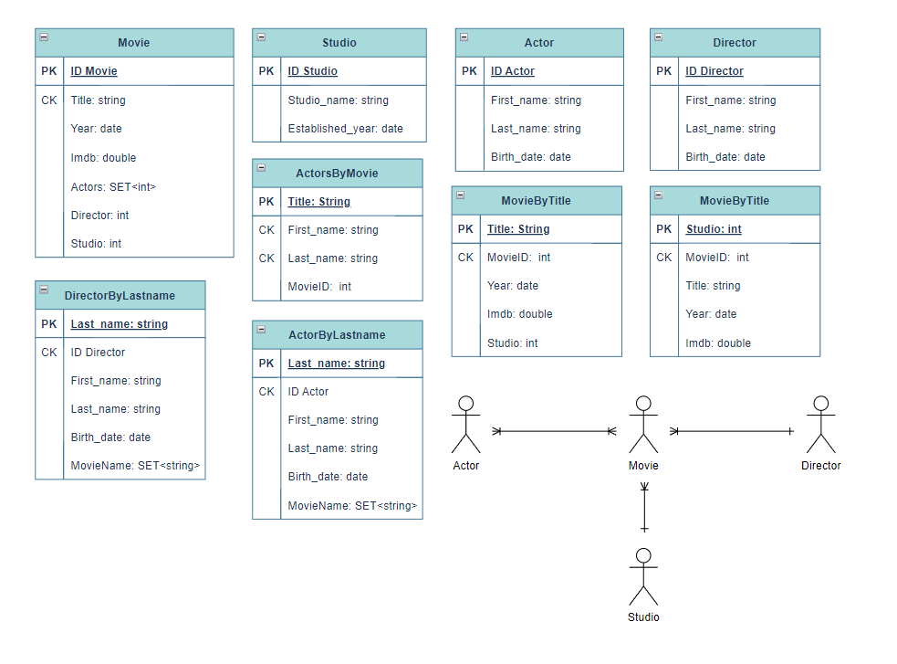

# Cassandra Movie Database

This project is a movie database management application implemented using Python and Cassandra. It allows users to create movie-related tables, insert data into these tables, and execute various queries to retrieve information about movies, actors, directors, and studios.

## Features

- Create tables for movies, actors, directors, and studios
- Insert data into these tables
- Execute queries to retrieve information about movies, actors, directors, and studios
- Display movies by studio, actor by last name, director by last name, and movie by title

